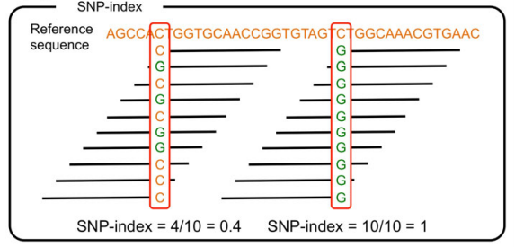

# 生物信息学分析方法和结果

***

## 原始数据质控和过滤

***

### 原始测序数据说明

***

&emsp;&emsp;为方便测序数据的分析、发布和共享，Illumina NovaSeq 平台测序得到的原始图像数据经过 Base Calling 转化为序列数据，得到最原始的测序数据文件。一般原始数据利用 FASTQ 格式进行储存。FASTQ 格式文件可记录所测读段（Read）的碱基及其质量分数。如图 3-1 所示，FASTQ 格式以测序读段为单位进行存储，每条 Reads 在 FASTQ 格式文件中占四行，其中第一行和第三行由文件识别标志（Sequence Identifiers）和读段名（ID）组成（第一行以 “@” 开头而第三行以 “+” 开头；第三行中 ID 可以省略，但 “+” 不能省略），第二行为碱基序列，第四行为对应位置碱基的测序质量分数。


<p class='mark'>图 3-1 读段FASTQ数据格式示例</p>

&emsp;&emsp;Illumina NovaSeq 测序仪一个 Run 有 2 个 Flowcell，一个 Flowcell 中包含 8 个 Lane，其中一个 Lane 包含 2 列，每一列又包含 60 个 Tile ，每一个 Tile 又会种下不同的 Cluster ，其产生的测序文件识别标志（Sequence Identifiers）中的详细信息如表 3-1 所示：

<p class='mark'>表 3-1 测序文件识别标志详细信息</p>
```{r echo=FALSE}
library(knitr)
data <- read.delim('src/fastq.xls',sep='\t',header=T,check.names = F)
kable(data,table.attr = "html") %>%
kable_styling(bootstrap_options=c("striped","hover","condensed"))
```

&emsp;&emsp;Reads 的质量分数以不同的字符来表示，其中每个字符对应的 ASCII 值减去 33 ，即为对应的测序质量值。一般地，碱基质量从 0-40，即对应的 ASCII 码为从 “！”（0+33）到 “I”（40+33），碱基质量越大，可信度越高。用 E 表示测序错误率，用 Q 表示 Illumina NovaSeq 的碱基质量值，则有下列关系：


<p class='mark'>表 3-2 测序错误率与测序质量值简明对应关系</p>

```{r echo=FALSE}///html
library(knitr)
data <- read.delim('src/err.xls',sep='\t',header=T,check.names = F)
kable(data,table.attr = "html",align='c') %>%
kable_styling(bootstrap_options=c("striped","hover","condensed"))
```

&emsp;&emsp; Illumina 测序属于第二代测序技术，单次运行能产生数百万级的 Reads ，如此海量的数据无法逐个展示每条 Read 的质量情况；运用统计学的方法，对所有测序 Reads 的每个 Cycle 进行碱基分布和质量波动的统计，可以从宏观上直观地反映出样本的测序质量和文库构建质量。我们针对每一个样本的原始测序数据进行测序相关质量评估，包括 A/T/G/C 碱基含量分布统计和碱基错误率分布统计。

<p class="mark">表 3-3 产出数据统计结果</p>


```{r echo=FALSE}///html
library(DT)///html
data <- read.delim('file/rawdata.xls',sep='\t',header=T,check.names = F)///html
datatable(data, rownames=F,options = list(columnDefs = list(list(className = 'dt-center',targets='_all'))))///html
```///html

```{r echo=FALSE}///pdf
library(knitr)///pdf
data <- read.delim('file/rawdata.xls')///pdf
kable(data, "html") %>%///pdf
kable_styling(bootstrap_options=c("striped","hover","condensed"))///pdf
```///pdf


<p class='mark1'>注：</p>

- <p class='mark1'>Sample ID：样本编号；</p>

- <p class='mark1'>Raw Reads：高质量的 Reads 数；</p>

- <p class='mark1'>Raw Bases(bp)：原始数据过滤后剩余的高质量测序数据总碱基数；</p>

- <p class='mark1'>Raw GC(%)：Clean Data 中的 GC 碱基占所有碱基的比例。</p>

- <p class='mark1'>Raw Q30(%)：Clean Data 中质量值大于或等于 30 的碱基所占百分比。</p>

### 测序碱基含量分布统计

***

&emsp;&emsp;碱基含量分布检查一般用于检测有无 A 与 T、G 与 C 分离现象。鉴于序列的随机性和碱基互补配对的原则，理论上每个测序循环上的 GC 含量相等、AT 含量相等，且在整个测序过程基本稳定不变，呈水平线。N 为测序仪无法判断的碱基类型。本项目中样品的碱基含量分布图如图 3-2 所示：

```{r echo=FALSE}///html
library(slickR)///html
state_plots <- list.files("file","*base.png",full.names=TRUE)///html
slickR(obj=state_plots,height=450,width='95%',)///html
```///html

```{r echo=FALSE}///pdf
library(shiny)///pdf
state_plots <- list.files("file","*base.png",full.names=TRUE)///pdf
img(src=state_plots[1])///pdf
```///pdf

<p class="mark">图 3-2 样本碱基组成分布例图</p>

<p class="mark1">注：横坐标是 Reads 碱基坐标，表示 Reads 上从 5’ 到 3’ 端依次碱基的排列；纵坐标是所有 Reads 在该测序位置 A、C、G、T、N 碱基分别占的百分比，不同碱基用不同颜色表示。序列的起始位置与测序的引物接头相连，因此 A、C、G、T 在起始端会有所波动，后面会趋于稳定。模糊碱基 N 所占比例越低，说明未知碱基越少，测序样本受系统 AT 偏好影响越小。虚线之前为 Read1 的统计，虚线之后为 Read2 的统计结果。</p>

### 测序碱基错误率分布统计

***

&emsp;&emsp;测序错误率会随着测序序列长度的增加而升高，这是由测序过程中化学试剂的消耗导致的，另外，由于 Illumina NovaSeq测序技术特点，测序片段前端几个 Cycles 和末端的错误率会偏高。本项目中样品的测序错误率分布图如图 3-3 所示：

```{r echo=FALSE}///html
library(slickR)///html
state_plots <- list.files("file","*qual.png",full.names=TRUE)///html
slickR(obj=state_plots,height=450,width='95%',)///html
```///html

```{r echo=FALSE}///pdf
library(shiny)///pdf
state_plots <- list.files("file","*qual.png",full.names=TRUE)///pdf
img(src=state_plots[1])///pdf
```///pdf

<p class="mark">图 3-3 样本碱基错误率分布例图</p>

<p class="mark1">注：横坐标是 Reads 碱基坐位置，表示 Reads 上从 5’ 到 3’ 端依次碱基的排列；纵坐标是所有 Reads 在该位点处碱基的平均错误率。前 150 bp 为双端测序序列的第一端测序 Reads 的错误率分布情况，后 150 bp 为另一端测序 Reads 的错误率分布情况。</p>

### 原始测序数据过滤

***

&emsp;&emsp;利用 Illumina 的建库测序平台，构建插入片段大小为 350 bp 左右的测序文库，按照项目合同要求进行测序，对原始数据进行质量评估，具体步骤如下：

&emsp;&emsp;Step1：去除 reads 中的 adapter 序列；

&emsp;&emsp;Step2：剪切前去除 5` 端含有非 AGCT 的碱基；

&emsp;&emsp;Step3：修剪测序质量较低的 reads 末端（测序质量值小于 Q20 ）；

&emsp;&emsp;Step4：去除含N的比例达到 10% 的 reads ；

&emsp;&emsp;Step5：舍弃去 adapter 及质量修剪后长度小于 25 bp 的小片段。

&emsp;&emsp;对质量剪切后的数据分别进行测序 Reads 数、总碱基数、GC 含量和 Q30 比例的统计，详细结果见表 3-4：

<p class="mark">表 3-4 测序质量统计表</p>

```{r echo=FALSE}///html
library(DT)///html
data <- read.delim('file/qc.xls',sep='\t',header=T,check.names = F)///html
datatable(data, rownames=F,options = list(columnDefs = list(list(className = 'dt-center',targets='_all'))))///html
```///html

```{r echo=FALSE}///pdf
library(knitr)///pdf
data <- read.delim('file/qc.xls')///pdf
kable(data, "html") %>%///pdf
kable_styling(bootstrap_options=c("striped","hover","condensed"))///pdf
```///pdf

<p class='mark1'>注：</p>

- <p class='mark1'>sample ID：样本编号；</p>

- <p class='mark1'>Clean Reads：高质量的 Reads 数；</p>

- <p class='mark1'>Clean Bases(bp)：原始数据过滤后剩余的高质量测序数据总碱基数；</p>

- <p class='mark1'>Clean GC(%)：Clean Data 中的 GC 碱基占所有碱基的比例。</p>

- <p class='mark1'>Clean Q30(%)：Clean Data 中质量值大于或等于 30 的碱基所占百分比。</p>


## 基因组比对

***

### 基因组比对效率

***

&emsp;&emsp;在本项目中，我们以 genome_chinese（genome_latin）的基因组序列作为参考基因组。利用 BWA 软件将质控后的测序片段（Clean Reads）比对参考基因组，比对方法为 MEME 。

&emsp;&emsp;样本比对率反映了样本测序数据与参考基因组的相似性，覆盖深度和覆盖度能够直接反应测序数据的均一性及与参考序列的同源性。参考基因组上被 reads 覆盖到的碱基数占基因组总长度的百分比称为基因组覆盖度；碱基上覆盖的 reads 数为覆盖深度。基因组覆盖度可以反映参考基因组上变异检测的完整性，覆盖到的区域越多，可以检测到的变异位点也越多。表 3-5 为比对结果的数据统计表。

<p class="mark">表 3-5 比对结果数据统计表</p>

```{r echo=FALSE}///html
library(DT)///html
data <- read.delim('file/align_stat.xls',sep='\t',header=T,check.names = F)///html
datatable(data, rownames=F,options = list(columnDefs = list(list(className = 'dt-center',targets='_all'))))///html
```///html

```{r echo=FALSE}///pdf
library(knitr)///pdf
data <- read.delim('file/align_stat.xls')///pdf
kable(data, "html") %>%///pdf
kable_styling(bootstrap_options=c("striped","hover","condensed"))///pdf
```///pdf

<p class="mark1">注：</p>

- <p class="mark1">Sample ID：客户样品编号；</p>

- <p class="mark1">Mapped Ratio：定位到基因组的 Clean Reads 数占所有 Clean Reads 数的百分比；</p>

- <p class="mark1">Properly Mapped：双端测序序列均定位到参考基因组上且距离符合测序片段的长度的 Reads 数占所有 Clean Reads 的百分比；</p>

- <p class="mark1">Duplicate Ratio：测序数据中冗余序列的比例，即由于 PCR 产生的 Reads 复制序列。</p>


### 深度分布统计

***

&emsp;&emsp; Reads 定位到参考基因组后，可以统计参考基因组上碱基的覆盖情况。基因组的覆盖深度会影响变异检测的准确性，在覆盖深度较高的区域（非重复序列区），变异检测的准确性也越高。另外，若基因组上碱基的覆盖深度分布较均匀，也说明测序随机性较好。样品测序基因组覆盖度如图 3-6 所示。

<p class="mark">表 3-6 样品覆盖深度和覆盖度统计</p>

```{r echo=FALSE}///html
library(DT)///html
data <- read.delim('file/coverage_sample.xls',sep='\t',header=T,check.names = F)///html
datatable(data, rownames=F,options = list(columnDefs = list(list(className = 'dt-center',targets='_all'))))///html
```///html

```{r echo=FALSE}///pdf
library(knitr)///pdf
data <- read.delim('file/coverage_sample.xls')///pdf
kable(data, "html") %>%///pdf
kable_styling(bootstrap_options=c("striped","hover","condensed"))///pdf
```///pdf

<p class="mark1">**注：**</p>

- <p class="mark1">Sample ID：样品编号；</p>

- <p class="mark1">Coverage 1X(%)：至少有一条 Reads 覆盖的碱基占基因组长度的百分比；</p>

- <p class="mark1">Coverage 5X(%)：至少有五条 Reads 覆盖的碱基占基因组长度的百分比；</p>

- <p class="mark1">Average Depth：平均覆盖深度。</p>


```{r echo=FALSE}///html
library(slickR)///html
state_plots <- list.files("file","*coverage.png",full.names=TRUE)///html
slickR(obj=state_plots,height=450,width='95%',)///html
```///html

```{r echo=FALSE}///pdf
library(shiny)///pdf
state_plots <- list.files("file","*coverage.png",full.names=TRUE)///pdf
img(src=state_plots[1])///pdf
```///pdf

<p class="mark">图 3-4 样品的染色体覆盖深度分布图</p>

<p class='mark1'>注：横坐标为染色体位置，纵坐标为染色体上对应位置的覆盖深度取对数（log2）得到的值。基因组被覆盖的较均匀，说明测序随机性较好。图上深度不均一的地方可能是由于重复序列、PCR 偏好性、或着丝粒部分引起的。</p>


## 变异检测及注释

***

&emsp;&emsp;单核苷酸多态性（Single Nucleotide Polymorphism，SNP），主要是指在基因组水平上由单个核苷酸的变异所引起的DNA序列多态性，是基因组上多态性最高的遗传变异之一。

&emsp;&emsp;SNP 变异类型分为转换和颠换两种，同种类型碱基（嘌呤与嘌呤、嘧啶与嘧啶）之间的突变称为转换（Transition）；不同类型碱基（嘌呤与嘧啶）之间的突变称为颠换（Transversion）。一般转换比颠换更容易发生，所以转换/颠换（Ts/Tv）的比例一般大于1，具体比值和所测物种有关。

&emsp;&emsp;InDel 是指基因组中小片段的插入（insertion）和缺失（deletion）序列。 

### SNP 检测

***

&emsp;&emsp;利用 GATK 的 Best Practices 流程处理比对结果（BAM 文件），利用 GATK 的 Haplotyper 方法进行 SNP 检测，过滤条件按照 GATK 推荐的参数进行，具体可见：（https://software.broadinstitute.org/gatk/documentation/article.php?id=3225）。与参考基因组进行比对，样品 SNP 统计结果见表 3-7：

<p class='mark'>表 3-7 SNP 数据统计表</p>

```{r echo=FALSE}///html
library(DT)///html
data <- read.delim('file/snp_stat.xls',sep='\t',header=T,check.names = F)///html
colnames(data)[1] = 'Type'///html
data = data.frame(t(data))///html
colnames(data)=data[1,]///html
data = data[-1,]///html
datatable(data, rownames=T,options = list(scrollX=T,columnDefs = list(list(className = 'dt-center',targets='_all'))))///html
```///html

```{r echo=FALSE}///pdf
library(knitr)///pdf
data <- read.delim('file/snp_stat.xls')///pdf
kable(data, "html") %>%///pdf
kable_styling(bootstrap_options=c("striped","hover","condensed"))///pdf
```///pdf

<p class='mark1'>**注：** </p>

- <p class='mark1'>pop：所有样本共有的数量；</p>

- <p class='mark1'>SNP Number：检测到的单核苷酸多态性位点的数量，表示材料与参考基因组之间的核苷酸变异；</p>

- <p class='mark1'>Transition：转换的 SNP 数量；</p>

- <p class='mark1'>Transversion：颠换的 SNP 数量；</p>

- <p class='mark1'>Ts/Tv：转换型 SNP（Transition）和颠换型 SNP（Transversion）的比值；</p>

- <p class='mark1'>Heterozygosity Number：杂合分型的 SNP 位点总数；</p>

- <p class='mark1'>Homozygosity Number：纯合分型的 SNP 位点总数。</p>


### SNP 功能注释

***

&emsp;&emsp;采用 SnpEff 程序结合本项目基因组注释信息，对检测到的 SNP 进行功能注释，SnpEff 会根据基因组的基因和功能区域的分布进行分析，对每个 SNP 所在的位置和功能进行统计，并对每个变异类型的功能进行统计。表 3-8 为 SNP 位置分布信息统计表，表 3-9 为 SNP 功效信息统计表：

<p class="mark">表 3-8 全基因组区域 SNP 位置分布信息统计表</p>

```{r echo=FALSE}///html
library(DT)///html
data <- read.delim('file/snp_region_anno.xls',sep='\t',header=T,check.names = F)///html
colnames(data)[1] = 'Type'///html
data = data.frame(t(data))///html
colnames(data)=data[1,]///html
data = data[-1,]///html
datatable(data, rownames=T,options = list(scrollX=T,columnDefs = list(list(className = 'dt-center',targets='_all'))))///html
```///html

```{r echo=FALSE}///pdf
library(knitr)///pdf
data <- read.delim('file/snp_region_anno.xls')///pdf
kable(data, "html") %>%///pdf
kable_styling(bootstrap_options=c("striped","hover","condensed"))///pdf
```///pdf

<p class="mark1">注：</p>

- <p class="mark1">3_prime_UTR_variant：样本在 3’UTR 区域的 SNP 个数；</p>

- <p class="mark1">5_prime_UTR_premature_start_codon_gain_variant：样本在 5‘UTR 区域,增加了一个启动子的 SNP 个数；</p>

- <p class="mark1">5_prime_UTR_variant：样本在 5’URT 区域的 SNP 个数；</p>

- <p class="mark1">Downstream_gene_variant：样本在基因下游区域的 SNP 个数；</p>

- <p class="mark1">Intergenic_region：样本在基因间区的 SNP 的个数；</p>

- <p class="mark1">Intragenic_variant：样本在基因内非功能区的 SNP 个数；</p>

- <p class="mark1">Intron_variant：样本在内含子区域的 SNP 位点个数；</p>

- <p class="mark1">Missense_variant：样本在外显子区域的错义突变的 SNP 位点个数；</p>

- <p class="mark1">non_coding_transcript_variant：样本非编码转录本突变的 SNP 个数；</p>

- <p class="mark1">Splice_acceptor_variant：样本在内含子左侧的连接点区域的 SNP 个数；</p>

- <p class="mark1">Splice_donor_variant：样本在内含子右侧的连接点区域的 SNP 个数；</p>

- <p class="mark1">Splice_region_variant：距离外显子或内含子 2 bp 的剪切位点的 SNP 个数；</p>

- <p class="mark1">Start_lost：由于 SNP 的突变导致启动子缺失的 SNP 位点个数；</p>

- <p class="mark1">Stop_gained：由于 SNP 的突变导致终止子获得的 SNP 位点个数；</p>

- <p class="mark1">Stop_lost：由于 SNP 的突变导致终止子突变的 SNP 位点个数；</p>

- <p class="mark1">Stop_retained_variant：由于 SNP 突变导致终止子的编码的发生了改变的 SNP 位点个数；</p>

- <p class="mark1">Synonymous_variant：同义突变的 SNP 位点个数；</p>

- <p class="mark1">Upstream_gene_variant：样本在基因上游的 SNP 位点个数及所占比例。</p>


<p class="mark">表 3-9 全基因组区域 SNP 功效信息统计表</p>

```{r echo=FALSE}///html
library(DT)///html
data <- read.delim('file/snp_effect_anno.xls',sep='\t',header=T,check.names = F)///html
colnames(data)[1] = 'Type'///html
data = data.frame(t(data))///html
colnames(data)=data[1,]///html
data = data[-1,]///html
datatable(data, rownames=T,options = list(scrollX=T,columnDefs = list(list(className = 'dt-center',targets='_all'))))///html
```///html

```{r echo=FALSE}///pdf
library(knitr)///pdf
data <- read.delim('file/snp_effect_anno.xls')///pdf
kable(data, "html") %>%///pdf
kable_styling(bootstrap_options=c("striped","hover","condensed"))///pdf
```///pdf

<p class="mark1">注：</p>

- <p class="mark1">HIGH：引起重要基因功能变化的突变，例如提前终止、起始密码子、内含子剪切位点突变；</p>

- <p class="mark1">MODERATE：引起中等基因功能变化的突变，例如错义突变；</p>

- <p class="mark1">LOW：引起较低或无基因功能变化的突变，例如同义突变；</p>

- <p class="mark1">MODIFIER：引起较低基因功能变化的突变，例如位于基因上游或下游的变异。</p>
### InDel 检测

***

&emsp;&emsp;利用 GATK 的 Best Practices 流程处理比对结果（BAM 文件），利用 GATK 的 Haplotyper 方法进行 InDel 检测及过滤，过滤条件按照 GATK 推荐的参数进行，具体可见：（https://software.broadinstitute.org/gatk/documentation/article.php?id=3225）。

&emsp;&emsp;对项目样品进行 InDel 标记开发，这里的 InDel 指能够明确获得序列组成的 InDel 标记。最终样本获得 Insertion 和 Deletion 详情如下。本次分析统计结果如表 3-10 所示：

<p class="mark">表 3-10 InDel数据统计表</p>

```{r echo=FALSE}///html
library(DT)///html
data <- read.delim('file/indel_stat.xls',sep='\t',header=T,check.names = F)///html
colnames(data)[1] = 'Type'///html
data = data.frame(t(data))///html
colnames(data)=data[1,]///html
data = data[-1,]///html
datatable(data, rownames=T,options = list(scrollX=T,columnDefs = list(list(className = 'dt-center',targets='_all'))))///html
```///html

```{r echo=FALSE}///pdf
library(knitr)///pdf
data <- read.delim('file/indel_stat.xls')///pdf
kable(data, "html") %>%///pdf
kable_styling(bootstrap_options=c("striped","hover","condensed"))///pdf
```///pdf

<p class="mark1">注：</p>

- <p class='mark1'>pop：所有样本共有的数量；</p>

- <p class="mark1">Insertion Number：检测到的插入变异的位点个数；</p>

- <p class="mark1">Deletion Number：检测到的缺失变异的位点个数；</p>

- <p class="mark1">Heterozygosity Number：杂合分型的 InDel 的位点个数； </p>

- <p class='mark1'>Homozygosity Number：纯合分型的 位点总数；</p>


### InDel 功能注释

***

&emsp;&emsp;采用 SnpEff 程序结合本项目基因组注释信息，对检测到的 SNP 进行功能注释，SnpEff 会根据基因组的基因和功能区域的分布进行分析，对每个 InDel 所在的位置和功能进行统计，并对每个变异类型的功能进行统计。表 3-11 为 InDel 位置分布信息统计表，表 3-12 为 InDel 功效信息统计表：：

<p class="mark">表 3-11 InDel 位置分布信息统计表</p>

```{r echo=FALSE}///html
library(DT)///html
data <- read.delim('file/indel_region_anno.xls',sep='\t',header=T,check.names = F)///html
colnames(data)[1] = 'Type'///html
data = data.frame(t(data))///html
colnames(data)=data[1,]///html
data = data[-1,]///html
datatable(data, rownames=T,options = list(scrollX=T,columnDefs = list(list(className = 'dt-center',targets='_all'))))///html
```///html

```{r echo=FALSE}///pdf
library(knitr)///pdf
data <- read.delim('file/indel_region_anno.xls')///pdf
kable(data, "html") %>%///pdf
kable_styling(bootstrap_options=c("striped","hover","condensed"))///pdf
```///pdf

<p class="mark1">注：</p>

- <p class="mark1">3_prime_UTR_variant：在 3’UTR 区域的 InDel 个数；</p>

- <p class="mark1">5_prime_UTR_variant：在 5’URT 区域的 InDel 个数；</p>

- <p class="mark1">Conservative_inframe_deletion：对蛋白翻译影响小的碱基缺失类型的移码突变的 InDel 个数；</p>

- <p class="mark1">Conservative_inframe_insertion：对蛋白翻译影响小的碱基插入类型的移码突变的 InDel 个数；</p>

- <p class="mark1">Disruptive_inframe_deletion：严重影响蛋白翻译的碱基缺失类型的移码突变的 InDel 个数；</p>

- <p class="mark1">Disruptive_inframe_insertion：严重影响蛋白翻译的碱基插入类型的移码突变的 InDel 个数；</p>

- <p class="mark1">Downstream_gene_variant：在基因下游区域的 InDel 个数；</p>

- <p class="mark1">Frameshift_variant：导致移码突变的 InDel 个数；</p>

- <p class="mark1">Intergenic_region：在基因间区的 InDel 的个数；</p>

- <p class="mark1">Intragenic_variant：在基因内非功能区的 InDel 个数；</p>

- <p class="mark1">Intron_variant：在内含子区域的 InDel 位点个数及所占比例；</p>

- <p class="mark1">Non_coding_transcript_variant：导致无法编码蛋白的 InDel 个数；</p>

- <p class="mark1">Splice_acceptor_variant：在内含子左侧的连接点区域的 InDel 个数及所占比例；</p>

- <p class="mark1">Splice_donor_variant：在内含子右侧的连接点区域的 InDel 个数及所占比例；</p>

- <p class="mark1">Splice_region_variant：距离外显子或内含子 2 bp 的剪切位点的 InDel 个数及所占比例；</p>

- <p class="mark1">Start_lost：由于InDel的突变导致启动子缺失的 InDel 位点个数及所占比例；</p>

- <p class="mark1">Stop_gained：由于InDel的突变导致终止子获得的 InDel 位点个数及所占比例；</p>

- <p class="mark1">Stop_lost：由于InDel的突变导致终止子缺失的 InDel 位点个数及所占比例；</p>

- <p class="mark1">Upstream_gene_variant：在基因上游区域的 InDel 个数及比例。</p>

<p class="mark">表3-12 InDel 功效信息统计表</p>

```{r echo=FALSE}///html
library(DT)///html
data <- read.delim('file/indel_effect_anno.xls',sep='\t',header=T,check.names = F)///html
colnames(data)[1] = 'Type'///html
data = data.frame(t(data))///html
colnames(data)=data[1,]///html
data = data[-1,]///html
datatable(data, rownames=T,options = list(scrollX=T,columnDefs = list(list(className = 'dt-center',targets='_all'))))///html
```///html

```{r echo=FALSE}///pdf
library(knitr)///pdf
data <- read.delim('file/indel_effect_anno.xls')///pdf
kable(data, "html") %>%///pdf
kable_styling(bootstrap_options=c("striped","hover","condensed"))///pdf
```///pdf

<p class="mark1">注：</p>

- <p class="mark1">HIGH：引起重要基因功能变化的突变，例如提前终止、起始密码子、内含子剪切位点突变；</p>

- <p class="mark1">MODERATE：引起中等基因功能变化的突变，例如错义突变；</p>

- <p class="mark1">LOW：引起较低或无基因功能变化的突变，例如同义突变；</p>

- <p class="mark1">MODIFIER：引起较低基因功能变化的突变，例如位于基因上游或下游的变异。</p>

## BSA关联分析

***

### 亲本标记开发

***

<style>
img.inline-img {
    display:inline;
    width:auto;
}

img.independent-img {
    display:block;
    width:auto;
}
</style>
&emsp;&emsp;基于上述变异检测结果，筛选两个亲本间纯合差异的遗传标记（除 F1 群体）， 挑选 SNP 标记及 InDel 标记信息见下表。


<p class='mark'>表 3-13 关联分析标记信息统计表</p>

```{r echo=FALSE}///html
library(DT)///html
data <- read.delim('file/chr_snp_indel_stat.xls',sep='\t',header=T,check.names = F)///html
datatable(data, rownames=F,options = list(scrollX=T,columnDefs = list(list(className = 'dt-center',targets='_all'))))///html
```///html

```{r echo=FALSE}///pdf
library(knitr)///pdf
data <- read.delim('file/chr_snp_indel_stat.xls')///pdf
kable(data, "html") %>%///pdf
kable_styling(bootstrap_options=c("striped","hover","condensed"))///pdf
```///pdf

<p class='mark1'>注：</p>

- <p class='mark1'>Chromosome ID：染色体编号；</p>

- <p class='mark1'>SNP Number：过滤后对应染色体上 SNP 数目；</p>

- <p class='mark1'>InDel Number：过滤后对应染色体上 InDel 数目。</p>

&emsp;&emsp;基于标记过滤所得到的亲本间差异的SNP和INDEL位点，分别进行 QTL-seq（Takagi et al., 2013），欧式距离（Euclidean Distance，ED）（Hill et al., 2013），G' value 统计（Magwene et al., 2011）三种方法进行关联分析。

### QTL-seq 方法

***

&emsp;&emsp;对开发所得到的亲本间 SNP 和 InDel 位点，以亲本 1 为参考，分别计算混池 1 和混池 2 中每个位点的 SNP-index 和 InDel-index 值。Index 值指在突变池和野生池中突变基因型占所有基因型中的深度比例，由于突变位点与周围标记具有连锁效应，在突变位点附近，混池 1 中的 Index 值更接近于 1，而混池中 2 的 Index 值更接近于 0 ；由于连锁效应较弱或不连锁的位点，呈现出随机分布，应符合孟德尔分离比例，正常位点 Index 值为 0.5；两混池间的 Index 差值关联的区域即是目标性状关联的候选区域。

&emsp;&emsp;以突变型和野生型混池为例，QTL-seq 计算方法简述如下：

&emsp;&emsp;Index(Mut)=DepM/(DepM+DepW) 

&emsp;&emsp;Index(Wild)= DepW/(DepM+DepW) 

&emsp;&emsp;ΔIndex=Index(Mut)-Index(Wild) 

&emsp;&emsp;其中，DepM 和 DepW 分别为突变型和野生型的等位基因在突变池与野生池中的 Reads 数目。



<p class='mark'>图 3-5 Index 计算方法示意图</p>

&emsp;&emsp;为了降低单一变异位点带来的随机波动，我们采用 index_windowSize 滑窗 和 loess 拟合两种方法对 ΔSNP-index 值进行进行降噪处理。为了提高分析准确性，我们对滑窗和 loess 拟合结果均使用 bootstrap 法针对不同位点深度和混池大小进行随机抽样 1000 次，之后分别取 p = Index_pvalue 和 p = loess_pvalue 获得阈值，同时为了避免标记不均匀带来的误差，我们要求候选区域内至少包含 variant_num 个阈值线之上的变异位点。变异位点 Index 在全基因组范围内的分布如图 3-6 所示。

```{r echo=FALSE}///html
library(slickR)///html
state_plots <- list.files("file","*index.png",full.names=TRUE)///html
slickR(obj=state_plots,height=400,width='95%',)///html
```///html

```{r echo=FALSE}///pdf
library(shiny)///pdf
state_plots <- list.files("file","*index.png",full.names=TRUE)///pdf
img(src=state_plots[1])///pdf
```///pdf

<p class='mark'>图 3-6 BSA QTL-seq 法的曼哈顿结果图</p>

<p class='mark1'>分别是 SNP-Index 滑窗法和 loess 拟合方法结果图；横轴：染色体长度（Mb）；纵轴分别是SNP/InDel-index、Loess 统计值；图中的点表示每个 SNP/InDel 对应的位置和上述2种方法计算的结果值，图中的黑线表示拟合的曲线，红色线表示阈值线。</p>

### G' value 统计方法
&emsp;&emsp; G 统计方法基于高通量、短读测序进行 QTL 定位的统计框架。该方法是基于标准统计量 G 的重新统计计算出的的 G’ 平滑版本，并考虑到由于分离子取样形成个体以及个体测序过程中引入的变异而导致的等位基因频率估计值的变化。通过模拟实验研究发现该方法可以用于检测到甚至是弱效应的 QTL。

&emsp;&emsp;每个 SNP 数据的自然统计量即标准 G 统计量计算公式如下：


&emsp;&emsp;其中是$\widehat{n_{i}}$数的期望值（$n_{i}$表示从分离体序列中产生的等位基因$A_{0}$和$A_{1}$的计数）。无效假设是没有显著的 SNP 或 indel 定位到 QTL。这意味着可按照列联表的标准预期计数，例如，，如果无假设正确，则。如果假设失效，则（C 是覆盖度）。 

&emsp;&emsp;G’ 是平滑版的 G 统计量，是基于每个窗口的 G 值使用局部回归模型来进行拟合得到的值。为了提高准确性，采用 G_windowSize 滑窗计算 G’ 值，并取 p = Gprime_pvalue 对应的 G’值作为筛选阈值，图 3-7 是 G 统计方法的曼哈顿结果图。

```{r echo=FALSE}///html
library(slickR)///html
state_plots <- list.files("file","2.Gprime.png",full.names=TRUE)///html
slickR(obj=state_plots,height=400,width='95%',)///html
```///html

```{r echo=FALSE}///pdf
library(shiny)///pdf
state_plots <- list.files("file","2.Gprime.png",full.names=TRUE)///pdf
img(src=state_plots[1])///pdf
```///pdf

<p class='mark'>图 3-7 BSA G' value 法的曼哈顿结果图</p>

<p class='mark1'> G' value 法的曼哈顿结果图；横轴：染色体长度（Mb）；纵轴是 G’ 统计值；图中的点表示每个 SNP/InDel 对应的位置和 G' value 方法计算的结果值，图中的黑线表示拟合的曲线，红色线表示阈值线。</p>

### 欧式距离（ED）法

&emsp;&emsp;欧式距离（Euclidean Distance，ED）算法，是利用测序数据寻找混池间存在显著差异标记，并以此评估与性状关联区域的方法。理论上，BSA项目构建的两个混池间除了目标性状相关位点存在差异，其他位点均趋向于一致，因此非目标位点的ED值应趋向于0。ED方法的计算公式如下所示，ED值越大表明该标记在两混池间的差异越大。


&emsp;&emsp;其中，Amut为A碱基在突变混池中的频率，Awt为A碱基在野生型混池中的频率；Cmut为C碱基在突变混池中的频率，Cwt为C碱基在野生型混池中的频率；Gmut为G碱基在突变混池中的频率，Gwt为G碱基在野生型混池中的频率；Tmut为T碱基在突变混池中的频率，Twt为T碱基在野生型混池中的频率。

&emsp;&emsp;为了降低单一SNP位点带来的随机波动，我们采用滑窗方法对 ED 值进行进行降噪处理，ED使用的滑窗大小为：ED_windowSize，同时，为了避免标记不均匀带来的误差，我们要求阈值线之上的窗口必须包含至少 variant_num 个阈值线之上的变异位点。为了提高分析准确性，我们使用分位数 ED_quantile 为阈值进行候选区域筛选。图 3-8 是 ED 方法的曼哈顿结果图：

```{r echo=FALSE}///html
library(slickR)///html
state_plots <- list.files("file","3.ED.png",full.names=TRUE)///html
slickR(obj=state_plots,height=400,width='95%',)///html
```///html

```{r echo=FALSE}///pdf
library(shiny)///pdf
state_plots <- list.files("file","3.ED.png",full.names=TRUE)///pdf
img(src=state_plots[1])///pdf
```///pdf

<p class='mark'>图 3-8 BSA ED 法的曼哈顿结果图</p>

<p class='mark1'> ED 法的曼哈顿结果图；横轴：染色体长度（Mb）；纵轴是 ED 值；图中的点表示每个 SNP/InDel 对应的位置和 ED 方法计算的结果值，图中的黑线表示拟合的曲线，红色线表示阈值线。</p>

## 候选区域定位分析

***

### 候选区域的 gene 筛选

***

&emsp;&emsp;理论上，候选区域内的 gene 都有可能与性状直接相关，在候选区域内的基因上，亲本之间或者混池之间发生了非同义突变的位点，影响了基因的功能和蛋白的结构编码，因此，筛选候选区域中发生变异的位点，有助于我们更快速的找到与性状相关的功能基因，以下是 SNP-Index 方法的候选区域统计结果，见表 3-14。

<p class='mark'>表 3-14 候选区域统计</p>

```{r echo=FALSE}///html
library(DT)///html
data <- read.delim('file/pop.region.xls',sep='\t',header=T,check.names = F)///html
datatable(data, rownames=F,options = list(scrollX=T,columnDefs = list(list(className = 'dt-center',targets='_all'))))///html
```///html

```{r echo=FALSE}///pdf
library(knitr)///pdf
data <- read.delim('file/pop.region.xls')///pdf
kable(data, "html") %>%///pdf
kable_styling(bootstrap_options=c("striped","hover","condensed"))///pdf
```///pdf

<p class='mark1'>注：</p>

- <p class='mark1'>Chrom：染色体编号；</p>

- <p class='mark1'>Pos Start：起始位点；</p>

- <p class='mark1'>Pos End：终止位点；</p>

- <p class='mark1'>Gene：关联区域 Gene 的数量；</p>

- <p class='mark1'>GeneEff：关联区域包含有效突变的 Gene 数量；</p>

- <p class='mark1'>SNP：关联区域 SNP 的数量；</p>

- <p class='mark1'>InDel：关联区域 INDEL 的数量；</p>

- <p class='mark1'>Effsnp：关联区域有效突变 SNP 的数量；</p>

- <p class='mark1'>EffInDel：关联区域有效突变 INDEL 的数量。</p>


### 候选区域内基因的 GO 富集分析

***

&emsp;&emsp;GO 数据库是一个结构化的标准生物学注释系统，建立了基因及其产物功能的标准词汇体系，适用于各个物种。该数据库结构分为多个层级，层级越低，节点所代表的功能越具体。通过 GO 分析并按照 Cellular component、Molecular Function、Biological process 对基因进行分类。

&emsp;&emsp;候选区域内基因 GO 分类统计结果见下图：

**重要提示：可通过下图">"标签切换为 ED 统计结果、G 结果以及 loess 结果**

```{r echo=FALSE}///html
library(slickR)///html
state_plots <- list.files("file","*_go_enrich.png",full.names=TRUE)///html
slickR(obj=state_plots,height=450,width='95%',)///html
```///html

```{r echo=FALSE}///pdf
library(shiny)///pdf
state_plots <- list.files("file","*_go_enrich.png",full.names=TRUE)///pdf
img(src=state_plots[1])///pdf
```///pdf

<p class="mark">图 3-9 候选区域内基因 GO 注释聚类图</p>

### 候选区域内基因的 KEGG 富集分析

***

&emsp;&emsp;在生物体内，不同基因相互协调来行使生物学功能，不同的基因间相同的作用通路为一个 Pathway，基于 Pathway 分析有助于进一步解读基因的功能。KEGG 是关于 Pathway 的主要公共数据库。

&emsp;&emsp;候选区域内基因的 KEGG 注释结果按照通路类型进行分类，分类图如下：

**重要提示：可通过下图">"标签切换为 ED 统计结果、G 结果以及 loess 结果**

```{r echo=FALSE}///html
library(slickR)///html
state_plots <- list.files("file","*_kegg_enrich.png",full.names=TRUE)///html
slickR(obj=state_plots,height=450,width='95%',)///html
```///html

```{r echo=FALSE}///pdf
library(shiny)///pdf
state_plots <- list.files("file","*_kegg_enrich.png",full.names=TRUE)///pdf
img(src=state_plots[1])///pdf
```///pdf

<p class="mark">图 3-9 候选区域内基因 KEGG 富集分析</p>

# 参考文献

- 1. [Michelmore R W, Paran I, Kesseli R V. Identification of markers linked to disease-resistance genes by bulked segregant analysis: a rapid method to detect markers in specific genomic regions by using segregating populations. Proceedings of the national academy of sciences, 1991, 88(21): 9828-9832.](https://www.ncbi.nlm.nih.gov/pmc/articles/PMC52814/)
- 2. [Takagi H, Abe A, Yoshida K, et al. QTL‐seq: rapid mapping of quantitative trait loci in rice by whole genome resequencing of DNA from two bulked populations. The Plant Journal, 2013, 74(1): 174-183.](https://pubmed.ncbi.nlm.nih.gov/23289725/)
- 3. [Singh V K, Khan A W, Saxena R K, et al. Indel‐seq: a fast‐forward genetics approach for identification of trait‐associated putative candidate genomic regions and its application in pigeonpea (Cajanus cajan). Plant Biotechnology Journal, 2017, 15(7): 906-914.](https://pubmed.ncbi.nlm.nih.gov/28027425/)
- 5. [Li H, Durbin R. Fast and accurate short read alignment with Burrows–Wheeler transform. bioinformatics, 2009, 25(14): 1754-1760.](https://www.ncbi.nlm.nih.gov/pmc/articles/PMC2705234/)
- 6. [McKenna A, Hanna M, Banks E, et al. The Genome Analysis Toolkit: a MapReduce framework for analyzing next-generation DNA sequencing data. Genome research, 2010, 20(9): 1297-1303.](https://genome.cshlp.org/content/20/9/1297.long)
- 7. [Cingolani P, Platts A, Wang L L, et al. A program for annotating and predicting the effects of single nucleotide polymorphisms, SnpEff: SNPs in the genome of Drosophila melanogaster strain w1118; iso-2; iso-3. Fly, 2012, 6(2): 80-92.](https://pubmed.ncbi.nlm.nih.gov/22728672/)
- 8. [Magwene P M, Willis J H, Kelly J K. The statistics of bulk segregant analysis using next generation sequencing. PLoS computational biology, 2011, 7(11): e1002255.](https://pubmed.ncbi.nlm.nih.gov/22072954/)

# 附录

***

## 软件列表

***


<p class='mark'> BSA 分析软件介绍</p>

```{r echo=FALSE}
library(knitr)
data <- read.delim('src/fujian.xls',sep='\t',header=T,check.names = F)
kable(data,table.attr = "html") %>%
kable_styling(bootstrap_options=c("striped","hover","condensed"))
```

## 相关软件下载链接如下：

***

- fastp：https://github.com/OpenGene/fastp

- BWA：http://bio-bwa.sourceforge.net/

- GATK：https://software.broadinstitute.org/gatk/

- SAMtools：http://www.htslib.org/

- Sentieon：https://www.sentieon.com/products/

- SnpEff：http://snpeff.sourceforge.net/

- Blast：https://blast.ncbi.nlm.nih.gov/Blast.cgi

## 附件说明及数据下载

***

### 文件解压缩方法

&emsp;&emsp;所有提供的文件均为 Linux 系统下的文件，压缩包使用 “tar -zcvf” 命令压缩， 以下为不同系统用户解压缩的方法：Unix/Linux/Mac 用户:  使用 tar -zcvf *.tar.gz 命令；Windows 用户：使用 WinRAR 软件解压缩

### 文件打开或浏览方法

&emsp;&emsp;如果在本附录中无特殊说明，所有提供的文件均为 Linux 系统下文本文件，Unix/Linux 用 户可以使用 more 或 less 命令查看文本文件内容。对于 Windows 用户，一般文本文件可以使用写字板或者 Excel 打开 。推荐使用开 Note Pad 打开超过 10M  以上的文本文件，或选择 Unix/Linux/MacOS 系统在终端中打开相关文件。

&emsp;&emsp;数据中可能包含部分图像文件，一般图像文件后缀名为.png 、.pdf、.gif、tiff 等，对于图像文件，Windows 用户可以使用图片浏览器打开，Linux/Unix 用户使用 display 命令打开。

&emsp;&emsp;后缀名为 svg 的文件为文本格式描述的图像文件，Windows 用户需要安装 Adobe Illustrator 软件打开。Linux/Unix 用户可以使用 rsvg-view 命令查看。公司默认提供“pdf“格式的矢量图，可利用 "Adobe Illustrator" 软件对该格式图片进行编辑。Linux 下的表格均为制表符（Tab）分割 的文本，为了便于阅读，建议使用 Excel 或 OpenOffice 等办公软件用表格形式打开，打开时请 用 “Tab” 分割方式。
---
title: <center>**全基因组重测序混池关联分析\n(BSA)**</center>

output: 
  html_document:
    css: css/bootstrap.min.css
    df_print: paged
    toc: true
    toc_float: true
    number_sections: true
    includes:
      in_header: css/header.html
      after_body: css/tailer.html
---

&nbsp;
&nbsp;
&nbsp;
```{r echo=FALSE}
library(knitr)
data <- read.delim('file/project_info.xls',sep='\t',header=T,check.names = F)
kable(data,table.attr = "html") %>%
kable_styling(bootstrap_options=c("striped","hover","condensed"))
```
&nbsp;
&nbsp;
&nbsp;
&nbsp;


# 项目信息

***

## 项目研究背景

***

&emsp;&emsp;BSA (Bulked Segregant Analysis)（Michelmore R W et al., 1991）集群分离分析法，是指利用目标性状存在差异的两个亲本构建家系，在子代分离群体中，选取目标性状个体构建 DNA 混合池，结合高通量测序技术对混合 DNA 样本测序，根据基因型频率的差异筛选基因组上与目标性状相关联的位点，并对其进行功能注释，进而研究控制目标性状的基因及其分子机制。

&emsp;&emsp;最常见的 BSA 分析流程，即所谓 QTL-seq 方法（Takagi H et al., 2013），针对自然变异中的 “高×低” 性状亲本杂交群体类型，按照 “两个亲本（>20×/亲本）+两个混池（>30 个样本/混池）” 的标准设计选择测序样本；针对亲本和混池分别建库测序后，在两个混池中寻找显著基因型频率差异的位点和区域，即可完成全基因组性状的关联分析。基于目标性状的不同特点，衍生出了一系列的拓展方法，如单点诱变产生的隐性纯和突变，可以只进行隐形混池测序，即 MutMap（Abe A et al., 2012）。

&emsp;&emsp;本项目利用高通量测序技术对 genome_chinese 的双亲/野生型亲本和两个极端表型/突变型的 F2 代个体进行混池测序，开发全基因组范围内的 SNP 和 InDel 标记（Singh V K et al., 2017），以其基因频率为基础，在全基因组范围内定位与目标表型相关的区域，筛选候选基因。

## 材料基本信息

```{r echo=FALSE}
library(knitr)
data <- read.delim('file/project.info.xls',sep='\t',header=T,check.names = F)
kable(data,table.attr = "html") %>%
kable_styling(bootstrap_options=c("striped","hover","condensed"))
```

## 项目服务内容

***

&emsp;&emsp;按照合同约定，对 sample_num 个检测合格的样本进行以下实验及分析：

- 1、全基因组重测序，每个混池各提供 Bulk_rawdata Raw Data，Q30≥80%。

- 2、比对参考基因组进行变异检测分析，具体内容包括：SNP 检测和注释、InDel 检测和注释。
- 3、关联分析：根据混池中基因型频率的差异，全基因组上筛选与目标性状相关联的位点，并对其进行注释。

## 分析结果概述

***

&emsp;&emsp;测序数据概述：

&emsp;&emsp;本次测序共获得到 Cleandata_size 的 clean data，Q30 达到 Q30_num ，混池平均测序深度为 Bulk_deoth 。样品与参考基因组平均比对效率为 Mapping_ratio，平均覆盖深度为 Avg_depth，基因组覆盖度为 Ref_coverage （至少一个碱基覆盖）。

&emsp;&emsp;变异检测：

&emsp;&emsp;SNP 检测：共获得 SNP_num 个 SNP。

&emsp;&emsp;InDel 检测：共获得 Indel_num 个 InDel。

&emsp;&emsp;关联分析：

&emsp;&emsp;采用 QTL-seq、欧式距离（ED）、G' value 三种算法，共得到 region_num 个与性状相关的侯选区域，候选区域总长度为 region_len，候选区域总的基因数为 region_gene。


# 项目流程

***

## 全基因组重测序实验流程

***

&emsp;&emsp;样品基因组 DNA 检测合格后，每个混池中 DNA 等量混合，利用超声波将亲本和混池 DNA 序列片段化形成随机片段，对片段化的 DNA 依次进行末端修复、3′ 端加 A、连接测序接头后，再利用磁珠吸附富集基因组长度为 350 bp 左右的片段，经过PCR扩增形成测序文库。建好的文库先进行文库质检，质检合格的文库用 Illumina NovaSeq 平台进行测序，测序策略为 Illumina PE150，总测序读长为 300 bp。建库流程见图 2-1。


<p class='mark'>图 2-1 全基因组重测序实验建库流程</p>


## 生物信息分析流程

***

&emsp;&emsp;在 Illumina NovaSeq 测序数据（Raw Data）下机之后，对下机数据进行质量控制，过滤其中低质量的数据，获得高质量的数据（Clean Data）。利用 BWA 软件（Li H et al., 2009）将Clean Data比对到参考基因组序列上，获得序列的位置归属（即 BAM 文件）。利用 GATK 软件（McKenna A et al., 2010）的 Best Practices 流程对 BAM 文件进行校正，并进行 SNP 标记的检测。利用 SNPEff 软件（Cingolani P et al., 2012）和参考基因组的基因预测信息进行变异功能注释，并进一步使用 SNP 及 InDel 进行性状定位分析。分析流程见图 2-2。


<p class='mark'>图 2-2 生信分析流程图</p>


