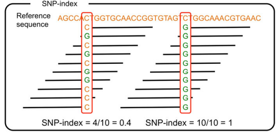

### Index方法

***

<style>
img.inline-img {
    display:inline;
    width:auto;
}

img.independent-img {
    display:block;
    width:auto;
}
</style>
&emsp;&emsp;Index值指在混池中突变型等位基因占所有等位基因中的深度比例，由于突变位点与周围标记具有连锁效应，在突变位点附近，混池中的Index值更接近于1；而那些连锁效应较弱或不连锁的位点，呈现出随机分布，应符合孟德尔分离比例，正常位点Index值为0.5；混池中Index值越接近于1的区域即是目标性状关联的候选区域。

&emsp;&emsp;计算方法简述如下：

&emsp;&emsp;Index(Mut)=DepM/(DepM+DepW)

&emsp;&emsp;其中，DepM 和 DepW 分别为突变型和野生型的等位基因在突变池中的 Reads 数目。



<p class='mark'>图 3-5 Mutmap中SNP-index计算方法</p>

&emsp;&emsp;对经过亲本标记过滤的子代变异位点，计算突变型混池中每个位点
的Index值。为了降低单一变异位点带来的随机波动，我们采用滑窗
和loess拟合两种方法对SNP-index值进行进行降噪处理。为了提高分析准确性，我们对滑窗
和loess拟合结果均使用bootstrap法针对不同位点深度和混池大小进行随机抽样1000次，之
后取阈值p≤0.001获得候选区间。同时为了避免标记不均匀带来的误差，我们要求候选区域
内至少包含5个阈值线之上的变异位点。滑窗和loess拟合降噪后的变异位点Index在全基因
组范围内的分布分别如图3-6和图3-7所示。

单条染色体的曼哈顿结果图详见结题文件夹目录下的：

Result/data_release/03.index/pop.index.\*.index.png/pdf、

Result/data_release/03.index/loess.\*.index.png/pdf（*代表染色体ID）

```{r echo=FALSE}
library(slickR)
state_plots <- list.files("../file","*index.png",full.names=TRUE)
slickR(obj=state_plots,height=400,width='95%',)
```

<p class='mark'>图 3-6和图 3-7 index方法拟合曼哈顿结果图</p>

<p class='mark1'>**注：**</p>
图中的一个点代表一个SNP/InDel标记，横轴为标记的染色体位置信息，纵轴为是SNP/InDel-index值；图中的黑线表示拟合的曲线，红色线表示阈值线。


