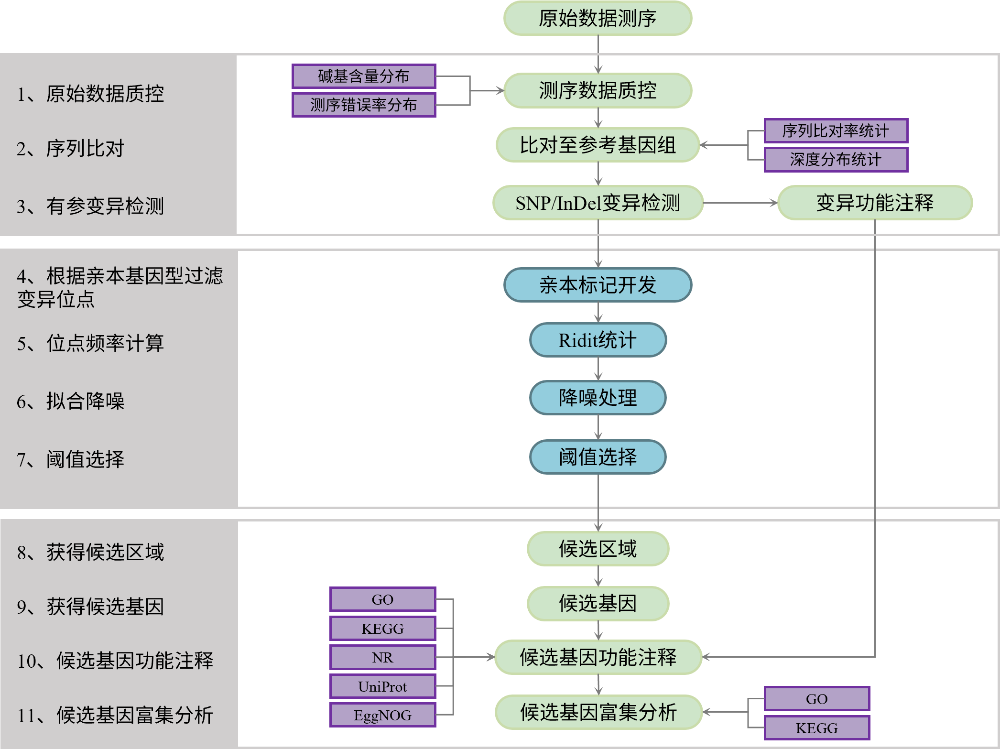

# 项目信息

***

## 项目研究背景

***

&emsp;&emsp;BSA（Bulked Segregant Analysis）（Michelmore *et al.* 1991）集群分离分析法，是指利用目标性状存在差异的两个亲本构建家系，在子代分离群体中，选取目标性状个体构建DNA混合池，结合高通量测序技术对混合DNA样本测序，根据基因型频率的差异筛选基因组上与目标性状相关联的位点，并对其进行功能注释，进而研究控制目标性状的基因及其分子机制。

&emsp;&emsp;本项目利用高通量测序技术对`r genome_chinese`的 F2 代个体进行混池测序，开发全基因组范围内的 SNP 和 InDel 标记，在`r genome_chinese`基因组上定位与突变表型相关的区域，筛选候选基因。

## 材料基本信息

```{r echo=FALSE}
library(knitr)
data <- read.delim('../file/material_info.xls',sep='\t',header=T,check.names = F)
kable(data,table.attr = "html") %>%
kable_styling(bootstrap_options=c("striped","hover","condensed"))
```

&emsp;&emsp;本项目混池样本对应关系如下：

```{r echo=FALSE}
library(knitr)
data <- read.delim('../file/mix_info.xls',sep='\t',header=T,check.names = F)
kable(data,table.attr = "html") %>%
kable_styling(bootstrap_options=c("striped","hover","condensed"))
```

## 项目服务内容

***

&emsp;&emsp;按照合同约定，对检测合格的样本进行以下实验及分析：

- 1、全基因组重测序，每个混池测序量达到合同标准，Q30≥80%。

- 2、比对参考基因组进行变异检测分析，具体内容包括：SNP检测和注释、InDel检测和注释。

- 3、关联分析：根据混池中SNP和Indel基因型频率的差异，全基因组上筛选与目标性状相关联的位点，并对其进行注释。

## 分析结果概述

***

```{r echo=FALSE}
library(knitr)
data <- read.delim('../file/stat_info.xls',sep='\t',header=T,check.names = F)
total_data <- data[1,2]
average_q30 <- data[2,2]
average_bulk_depth <- data[3,2]
mapping_ratio <- data[4,2]
p_snp_num <- data[5,2]
p_indel_num <- data[6,2]
b_snp_num <- data[7,2]
b_indel_num <- data[8,2]
ridit_num <- data[9,2]
ridit_length <- data[10,2]
ridit_transcript <- data[11,2]
ridit_gene <- data[12,2]
```

&emsp;&emsp;**1.测序数据概述：**

&emsp;&emsp;本次测序混池共获得 `r total_data ` 的 clean data，Q30 达到 `r average_q30` ，混池平均测序深度为 `r average_bulk_depth` 。样品与参考基因组平均比对效率为 `r mapping_ratio`。

&emsp;&emsp;**2.变异检测：**

&emsp;&emsp;亲本共检测到 `r p_snp_num` 个 SNP; `r p_indel_num` 个 InDel。

&emsp;&emsp;混池共检测到 `r b_snp_num` 个 SNP; `r b_indel_num` 个 InDel。

&emsp;&emsp;**3.关联分析：**

&emsp;&emsp;采用ridt方法进行关联分析，共得到 `r ridit_num` 个与性状相关的候选区域，长度为 `r ridit_length` ，其中包含 `r ridit_transcript` 个转录本, `r ridit_gene` 个基因；

# 项目流程

***

## 全基因组重测序实验流程

***

&emsp;&emsp;样品基因组 DNA 检测合格后，每个混池中 DNA 等量混合，利用超声波将亲本和混池 DNA 序列片段化形成随机片段，对片段化的 DNA 依次进行末端修复、3′ 端加 A、连接测序接头后，再利用磁珠吸附富集基因组长度为 350 bp 左右的片段，经过PCR扩增形成测序文库。建好的文库先进行文库质检，质检合格的文库用 Illumina NovaSeq 平台进行测序，测序策略为 Illumina PE150，总测序读长为 300 bp。建库流程见图 2-1。


<p class='mark'>图 2-1 全基因组重测序实验建库流程</p>


## 生物信息分析流程

***

&emsp;&emsp;在 Illumina NovaSeq 6000 测序数据（Raw Data）下机之后，对下机数据进行质量控制，过滤其中低质量的数据，获得高质量的数据（Clean Data）。利用 BWA-MEME 软件（Jung *et al.* 2009）将 Clean Data 比对到参考基因组序列上，获得序列的位置归属（即 BAM 文件）。利用GATK软件（McKenna *et al.* 2010）的 Best Practices 流程对BAM文件进行校正，并进行 SNP 和 InDel 标记的检测。利用 SnpEff 软件（Cingolani *et al.* 2012）和参考基因组的基因预测信息进行变异功能注释，并进一步使用 SNP 和 InDel 进行性状定位分析。分析流程见图2-2。



<p class='mark'>图 2-2 生信分析流程图</p>


